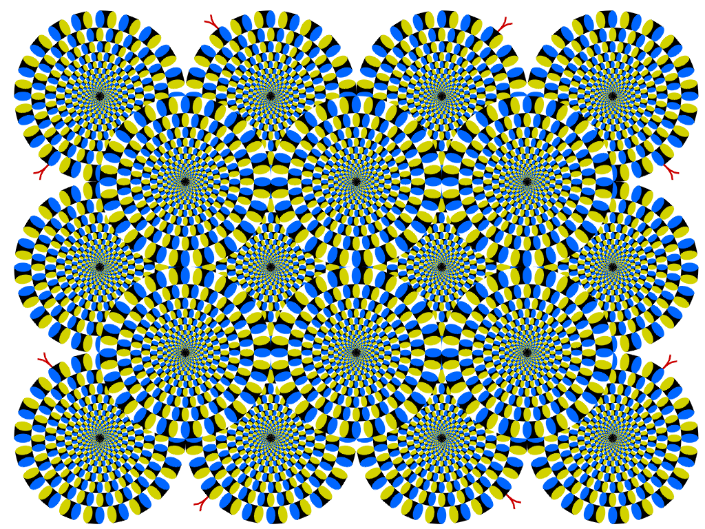

# Snake Illusion Research Tools

*Original "Rotating Snakes" illusion by Akiyoshi Kitaoka, 2003*

A comprehensive toolkit for Snake Illusion research, developed as a final project for Electrical Engineering studies at Tel Aviv University.

## Overview

This repository contains three integrated tools for studying the Snake Illusion - an optical illusion where static patterns appear to move. The tools enable researchers to create custom illusions, conduct psychophysical experiments, and analyze participant responses.

## Tools

- **[Illusion Generator](illusion-generator/)** - Python application for creating Snake Illusion variations with precise parameter control.
- **[Psychophysical Experiment](psychophysical-experiment/)** - Web-based experiment for testing motion perception in participants.
- **[Analysis Tool](analysis-tool/)** - MATLAB script for statistical analysis of experimental data.

## Research Applications

These tools support systematic investigation of:
- Motion perception in optical illusions.
- Effects of color, saturation, and pattern variations.
- Psychophysical response measurement and analysis.
- Comparative studies between different illusion types.

## Getting Started

Each tool has its own setup instructions and documentation. See the individual directories for:
- Installation requirements.
- Usage instructions.
- Customization options.
- Troubleshooting guides.

## Academic Context

**Institution**: Tel Aviv University.
**Faculty**: Faculty of Engineering. 
**Project Type**: Final Project in Electrical Engineering.
**Research Focus**: Creating and studying new variations of the Snake Illusion.

## License

This project was developed for academic research purposes.