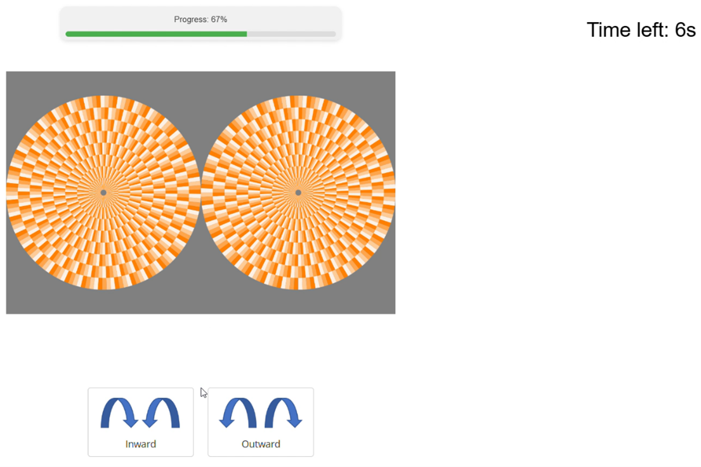

# Snake Illusion Chromatic Experiment

A web-based psychophysical experiment for testing participants' perception of motion direction in snake illusion images. Built with jsPsych for systematic data collection and analysis.


*Main experiment interface*

## Features

- **Timed Trials**: 6-second response window with visual countdown
- **Randomized Presentation**: Automatic stimulus randomization
- **Progress Tracking**: Visual progress bar and break opportunities
- **Data Collection**: Automatic recording of responses, reaction times, and parameters
- **Quality Control**: Image preloading, response validation, practice trials
- **Customizable**: Easy stimulus set configuration and timing adjustment


*Experiment flow from welcome to completion*

## Technical Requirements

- **Platform**: Cognition.run (web-based)
- **Framework**: jsPsych 7.x
- **Browser**: Modern browser with JavaScript
- **Files**: Stimulus images + experiment script

## Quick Setup

1. **Prepare Stimuli**: Generate images using Snake Illusion Generator
2. **Configure Experiment**: Update image mapping and parameters in JavaScript
3. **Upload Files**: Upload script and images to Cognition.run
4. **Test**: Verify all images load and timing works correctly
5. **Deploy**: Launch experiment for data collection

**⚠️ Important**: Press ESC at the end of the experiment to save results!

## Experiment Structure

### Trial Flow
1. **Welcome Screen** - Instructions and overview
2. **Training Check** - Skip practice if experienced
3. **Practice Trial** - Single trial with feedback
4. **Main Experiment** - Randomized trials with breaks
5. **Completion** - Thank you and data save

### Timing
- **Trial Duration**: 6 seconds per image
- **Response Window**: Full 6 seconds (forced if missed)
- **Breaks**: Every 4 trials (configurable)

## Customization

### Configure Your Stimuli
```javascript
var imageMapping = {
  'img1': 'your_stimulus_1.png',
  'img2': 'your_stimulus_2.png'
};

var imageParameters = {
  'img1': { param1: 'value_a', param2: 'setting_1' },
  'img2': { param1: 'value_b', param2: 'setting_2' }
};
```

### Adjust Settings
```javascript
// Break frequency (0 = no breaks)
var BREAK_FREQUENCY = 4;

// Trial timing (milliseconds)
trial_duration: 6000
```

## File Requirements

### Core Files
- `Chromatic experiment.js` - Main experiment script
- `practice_example.png` - Practice trial image
- `Inward.png` / `Outward.png` - Response button icons
- `Snake_cartoon.png` - Welcome screen illustration

### Stimulus Images
Any snake illusion images - filename format doesn't matter since parameters are configured in the mapping for convenience:

```javascript
var imageParameters = {
  'img1': { param1: 'value_a', param2: 'setting_1' },
  'img2': { param1: 'value_b', param2: 'setting_2' }
};
```

## Data Collection

**Automatically Records:**
- Response choice (Inward/Outward)
- Reaction time
- Stimulus parameters (as configured)
- Late responses (after 6-second limit)
- Trial sequence and timing

## Important Notes

**Data Saving**: Participants must press ESC at the end to save results - include this in your instructions!